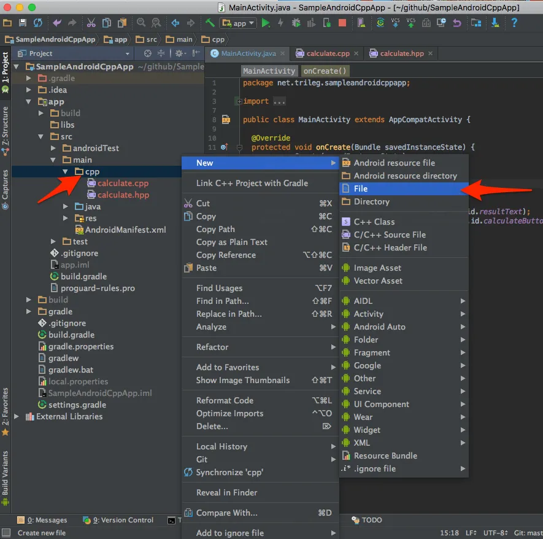

本記事では，既存のAndroidプロジェクト（プログラム）にC/C++で書かれた処理コードを組み込み，JavaコードからあるデータをC/C++コードに渡して処理させ，処理結果をJavaコードで受け取ってViewに表示する方法についてまとめる．また，本記事ではndk-build（Application.mkやAndroid.mkを用いるもの）ではなくCMakeを用いたC/C++コードのビルド方法について説明する．説明に用いるサンプルプロジェクトはGitHubの[SampleAndroidCppApp](https://github.com/arkenous/SampleAndroidCppApp)で公開しているので，あわせて参考にしてほしい．

## Android NDK環境の導入

まずはAndroidプロジェクトでC++コードを動かすためにAndroid NDK環境をインストールする．インストールにはAndroid SDKを用いるので，以下の画像で示すアイコンをクリックしてAndroid SDK Managerを起動する．


起動したら，`SDK Tools`タブを選択し，C/C++ソースファイルのビルドに用いる`CMake`とC/C++コードをデバッグするための`LLDB`，`NDK`にチェックマークを入れて右下の`Apply`をクリックする．


インストールできたら，次にProject Structureを起動する．


起動したら`SDK Location`の最下部にある`Android NDK location`の下部にある`Select default NDK`を選択してAndroid NDKのパスをプロジェクトに設定する．


設定できたら，次にC++ソースファイル等を配置する`cpp`ディレクトリの作成と，C++ソースファイル，CMakeでのC/C++ソースファイルのビルドに用いる`CMakeLists.txt`ファイルの作成を行う．

## C++ソースファイルとCMakeLists.txtの追加

まずは`cpp`ディレクトリを作成する．プロジェクトツリーが表示されているペインで初期状態で`Android`と表示されている部分をクリックし，`Project`に変更する[^project]．変更できたら，`app/src/main/`で右クリックし，`New->Directory`を選んで`cpp`で作成する．


作成できたら，この`cpp`ディレクトリを右クリックし，`New->C/C++ Source File`を選んでC++のソースファイルを作成する．


今回の例では，以下のようなコードを用意した．

`app/src/main/cpp/calculate.hpp`

```hpp
#ifndef SAMPLEANDROIDCPPAPP_CALCULATE_HPP
#define SAMPLEANDROIDCPPAPP_CALCULATE_HPP

class Calculate {
public:
  Calculate();
  int calc(int initial_value);

private:
  static const int LOOP = 1000000;
};

#endif //SAMPLEANDROIDCPPAPP_CALCULATE_HPP
```

`app/src/main/cpp/calculate.cpp`

```hpp
#include "calculate.hpp"
#include <android/log.h>

Calculate::Calculate() {}

int Calculate::calc(int initial_value) {
  __android_log_print(ANDROID_LOG_INFO, "calculate", "method calc called, initial_value: %d", initial_value);
  int result_value = initial_value;

  for (int i = 0; i < LOOP; ++i) {
    ++result_value;
  }

  return result_value;
}
```

`app/src/main/cpp/jni_main.cpp`

```cpp
#include "calculate.hpp"

#ifdef __cplusplus
extern "C" {
#endif

#include <jni.h>

JNIEXPORT jint JNICALL Java_net_trileg_sampleandroidcppapp_MainActivity_calc(JNIEnv *env, jobject thiz, jint _initial_value) {
  Calculate calculate;

  int initial_value = _initial_value;
  int result = calculate.calc(initial_value);

  jint _result = result;
  return _result;
}

#ifdef __cplusplus
}
#endif
```

`calculate.cpp`には`android/log.h`もインクルードしている．これは後述する`CMakeLists.txt`において追加する`log`ライブラリを用いるためのもので，このライブラリを用いたlogcatへのログの出力はソースコード中の以下のコードで行っている．

```cpp
__android_log_print(ANDROID_LOG_INFO, "calculate", "method calc called, initial_value: %d", initial_value);
```

`jni_main.cpp`はJavaコードとC/C++コードとの橋渡しを行うためのソースファイルである．`JNI（Java Native Interface）`という仕様に沿って記述する．JNI以外にも`JNA（Java Native Access）`や`SWIG（Simplified Wrapper and Interface Generator）`といった仕様がある．上記コードを見てもらえれば何となく雰囲気はつかめるかと思うが，Javaから呼び出す関数名は，`JNIEXPORT JNI型 JNICALL Java_パッケージ名（.は_に）_クラス名_メソッド名`という風に命名しなければならない[^jni]．

作成できたら，これらソースファイルをビルドするための`CMakeLists.txt`ファイルを作成する．



今回の例では，以下のような内容で作成した．

`app/src/main/cpp/CMakeLists.txt`

```txt
cmake_minimum_required(VERSION 3.6)

find_library ( log-lib log )

add_library ( calculate SHARED calculate.cpp jni_main.cpp )
target_link_libraries ( calculate ${log-lib} )
```

この例では，C/C++コード内からAndroid Monitorのlogcatにログを出力できるように，Android NDKに標準で用意されている`log`ライブラリを追加している[^ndklib]．

`CMakeLists.txt`を作成できたら，Gradleからこの`CMakeLists.txt`を用いてビルドするようにリンク設定を行う．`app`ディレクトリを右クリックし，`Link C++ Project with Grade`を選ぶ．表示されるダイアログから先ほど作成した`CMakeLists.txt`までのパスをファイルダイアログから選択して入力し，設定を行う．


この設定により，`app/`直下の`build.gradle`において，`android`で括られた内部に以下のコードが追加されているはずだ．

```gradle
externalNativeBuild {
  cmake {
    path 'src/main/cpp/CMakeLists.txt'
  }
}
```

さらに，C++11と最適化オプションを使うためのフラグ設定と，STLを用いるための設定を行う．同じく`app/`直下の`build.gradle`において，`android`の中のさらに`defaultConfig`の中に，以下のコードを追加する[^runtime]．

```gradle
externalNativeBuild {
  cmake {
    cppFlags "-std=c++11 -Ofast"
    arguments "-DANDROID_STL=c++_static"
  }
}
```

設定できたら，次はJava側からC++コードを利用するコードを記述する．

## C++コードをJavaから利用するためのコードの追加

今回の例では，簡単に以下のような画面構成のアプリを用意した．


画面下部にある`CALCULATE`ボタンを押すことで`jni_main.cpp`を通じて`calculate.cpp`のメソッドを呼び出し，計算結果を上部の`Result`に反映するというものだ．

この画面に対応するJavaコードは以下のように実装した．

```java
package net.trileg.sampleandroidcppapp;

import android.support.v7.app.AppCompatActivity;
import android.os.Bundle;
import android.view.View;
import android.widget.Button;
import android.widget.TextView;

public class MainActivity extends AppCompatActivity {

    static {
        System.loadLibrary("calculate");
    }

    public native int calc(int initial_value);
    
    int initial_value = 3;
    int result_value = 0;
    
    @Override
    protected void onCreate(Bundle savedInstanceState) {
        super.onCreate(savedInstanceState);
        setContentView(R.layout.activity_main);
        
        final TextView resultText = (TextView) findViewById(R.id.resultText);
        final Button calculateButton = (Button) findViewById(R.id.calculateButton);
        
        calculateButton.setOnClickListener(new View.OnClickListener() {
            @Override
            public void onClick(View v) {
                result_value = calc(initial_value);
                resultText.setText(String.valueOf(result_value));
            }
        });
    }
}
```

この中でミソなのが以下のコードである．

```
static {
    System.loadLibrary("calculate");
}

public native int calc(int initial_value);
```

まず，`System.loadLibrary("calculate");`で`CMakeLists.txt`をもとにC++ソースファイルをビルドして得た共有ライブラリを読み込むのだが，この引数には`CMakeLists.txt`の`target_link_libraries`の一つ目の引数で設定した名称（今回の例では`calculate`）を渡す（生成されるライブラリ名は`libcalculate.so`という風になるが，`lib`と`.so`を省いたものとなる）．

次に，JNIのコードである`jni_main.cpp`に書いたメソッドに対応するネイティブメソッドを宣言する．これはJNIで指定したクラス直下であれば，コードの先頭でも末尾でも問題ない．

ここまででC++コードを呼び出す準備が整ったことになる．Javaコード内で通常のメソッドと同様にネイティブメソッドを呼び出せば，JNIを通じてC++コードで処理が行われ，結果が返ってくる．

---

## 参考

- [プロジェクトへの C / C++ コードの追加 | Android Studio](https://developer.android.com/studio/projects/add-native-code.html?hl=ja)

[^project]: Projectに変更せず，Androidのままでappディレクトリを右クリックしてディレクトリを作成，でも大丈夫だと思うが，ディレクトリの作成場所を明確にしておきたかったのでこの方法にした．

[^jni]: JNIでのコードの書き方については，[JNIメモ(Hishidama's Java native interface Memo)](http://www.ne.jp/asahi/hishidama/home/tech/java/jni.html)が参考になる．

[^ndklib]: Android NDKで標準で使うことのできるライブラリについては，[Android NDK ネイティブ API | Android Developers](https://developer.android.com/ndk/guides/stable_apis.html?hl=ja)を参照のこと．

[^runtime]: 使用可能なC++ランタイムは[C++ ライブラリ サポート | Android Developers](https://developer.android.com/ndk/guides/cpp-support.html?hl=ja)を参照のこと．

