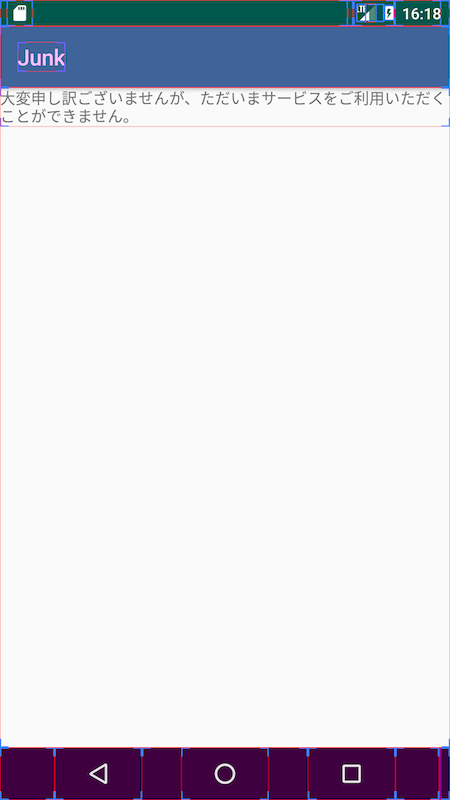
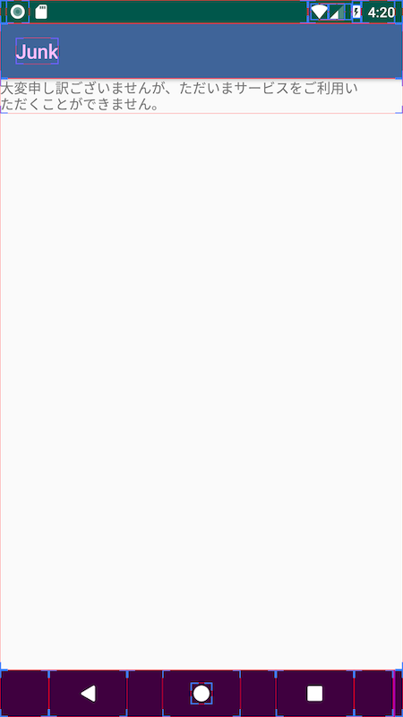
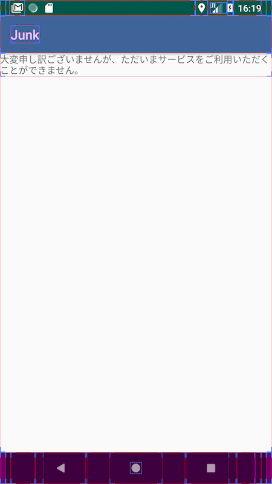
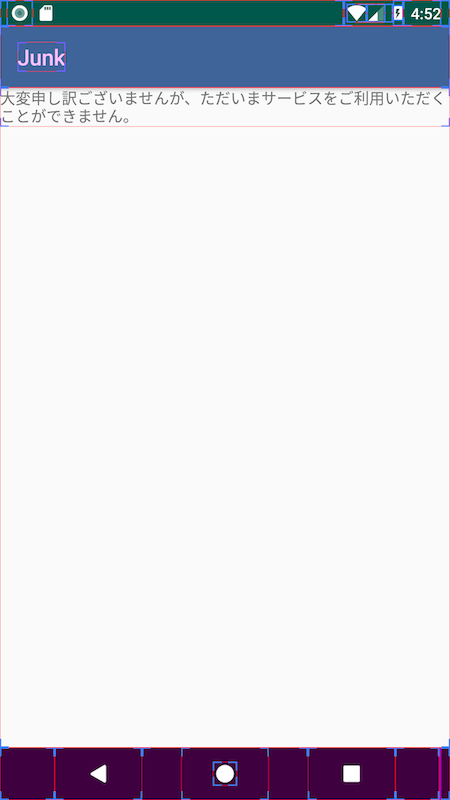

[こちら](https://issuetracker.google.com/issues/64418117)のチケットで報告されているように、Android Oreo 8.0.0のTextViewにはテキスト折り返しのバグが存在する。

文節の長い文章をTextViewを表示させた場合、TextViewを画面幅一杯に広げている場合でも以下のように8.0.0のみ右端に大きな余白が空いてしまう場合がある。

|7.0|8.0.0|8.1.0|
|:---:|:---:|:---:|
||||

テキスト折り返しのルールは、Android 6.0で追加された[breakStrategy](https://developer.android.com/reference/android/widget/TextView.html#attr_android:breakStrategy)プロパティによって制御できる。このルールは以下の三種類あり、デフォルトでは最も手厚い`BREAK_STRATEGY_HIGH_QUALITY`が利用される。

- [BREAK_STRATEGY_SIMPLE](https://developer.android.com/reference/android/text/Layout.html#BREAK_STRATEGY_SIMPLE)
- [BREAK_STRATEGY_BALANCED](https://developer.android.com/reference/android/text/Layout.html#BREAK_STRATEGY_BALANCED)
- [BREAK_STRATEGY_HIGH_QUALITY](https://developer.android.com/reference/android/text/Layout.html#BREAK_STRATEGY_HIGH_QUALITY)

このうちデフォルトで用いられている`BREAK_STRATEGY_HIGH_QUALITY`によるテキスト折り返しについて8.0.0のみ実装にバグがあるようで、8.1.0ではこの点が修正されている。

8.0.0で発生するこのバグを迂回するためには、`BREAK_STRATEGY_SIMPLE`を明示的に指定する。

|8.0.0 HIGH_QUALITY|8.0.0 SIMPLE|8.1.0 HIGH_QUALITY|
|:---:|:---:|:---:|
||||

