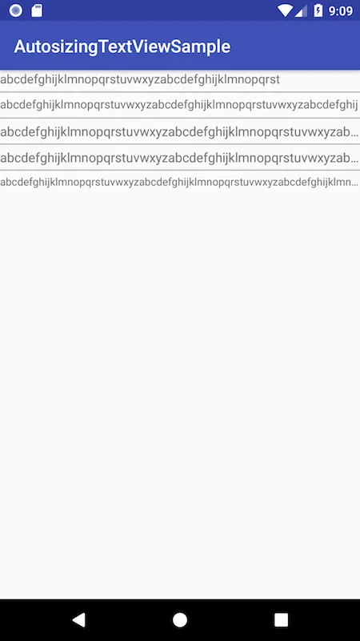
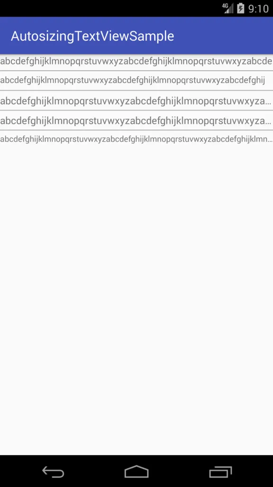
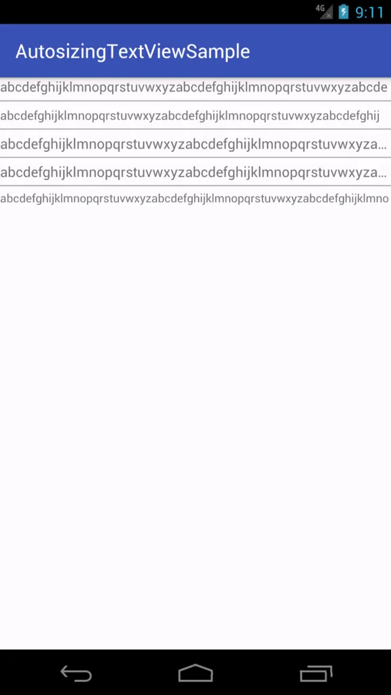

## 概要

[Autosizing TextView](https://developer.android.com/guide/topics/ui/look-and-feel/autosizing-textview)はAndroid 8.0（API 26, Oreo）より導入された機能で、これを用いることでTextViewのレイアウトサイズに応じて自動的にテキストサイズを調整してくれる。例えば、レイアウトサイズに収まりきらないような長いテキストを表示する必要がある場合、全てのテキストが表示可能な最大限のテキストサイズをシステムが自動で設定してくれる。また、テキストサイズ調整の許容幅（上限・下限サイズ）や調整ステップの設定も可能で、ellipsize Attributeと併用することで下限サイズでもテキストを全て表示できなかった場合は末尾を…で省略する、といったことも可能である。

Support Library 26.0を用いることでAndroid 8.0（API 26, Oreo）以前でAndroid 4.0（API 14, Ice Cream Sandwich）までの端末でもこの機能を用いることができる。なお、レイアウトXML中でTextViewを用いていても、親のActivityやDialogクラス等がAppCompatを継承したクラスであればレイアウトのInflate時に自動的にAppCompatTextViewになる。そのためわざわざレイアウトXML中でTextViewの代わりにAppCompatTextViewを指定する必要はない。

## 利用方法

詳しい説明は[公式リファレンス](https://developer.android.com/guide/topics/ui/look-and-feel/autosizing-textview)に任せるとして、アプリでこの機能を使う際は後方互換性を意識し、公式サンプルに則ってTextViewに以下の`app:autoSizeTextType` Attributeを追加することになると思う。

```xml
<TextView
    android:layout_width="match_parent"
    android:layout_height="20dp"
    app:autoSizeTextType="uniform"
```

上記により、`layout_width="match_parent"`、`layout_height="20dp"`の領域にテキストが収まりきらない場合に、テキストサイズが自動で縮小される。

TextViewを用いる場合、widthとheightの両方に`match_parent`や`20dp`等の固定値を設定することはなかなか無いかと思う。だが、Autosizing TextViewを用いる場合は、widthやheightに`wrap_content`を指定することは予期せぬ結果を生む可能性があるとして非推奨となっている。

> If you set autosizing in an XML file, it is not recommended to use the value "wrap_content" for the layout_width or layout_height attributes of a TextView. It may produce unexpected results.

## テキストを一行表示する場合

テキストを一行表示する場合、以下のAttributeが挙げられるかと思う。

- `singleLine="true"`
- `maxLines="1"`

このうち`singleLine`についてはAPI 3時点で既にdeprecatedになっており、今後使うことはないと思う。`singleLine="true"`と設定した場合、テキストがレイアウト幅に収まらなかった際に自動で`ellipsize="end"`が効いた表示になる。そのため`singleLine="true"`と同様の挙動を`maxLines`で行う際は、`maxLines="1"`に加えて`ellipsize="end"`の指定も必要となる。

### Attribute指定によるAutosizing TextViewの挙動の差異について

サンプルとして用意した`abcdefghijk...`という文字列をセットし`layout_width="match_parent`と`layout_height="20dp"`を設定したTextViewに対し、以下のようにAttributeをセットして挙動を確認してみた。

1. `maxLines="1"`のみ設定
2. `maxLines="1"`と`autoSizeTextType="uniform"`を指定
3. `singleLine="true"`と`autoSizeTextType="uniform"`を指定
4. `maxLines="1"`と`singleLine="true"`、`autoSizeTextType="uniform"`を指定
5. `maxLines="1"`と`ellipsize="end"`、`autoSizeTextType="uniform"`を指定

#### Android 8.0の場合

Android 8.0エミュレータでは、以下画像のようになった。



一つ目の例ではテキストが収まりきらないために後ろの文字列が落ちてしまっているが、二つ目の例では自動でテキストサイズが縮小され、全て表示されている。三つ目と四つ目は`singleLine="true"`を設定しているためか、テキストサイズの自動調整は効かず、末尾が勝手にellipsizeされている。

AutosizingTextViewでは、`minTextSize`や`maxTextSize`、`granularity`を設定することで、テキストサイズ調整の下限・上限、調整ステップを変更できる。これらを設定しない場合、デフォルトで以下の設定が用いられる。

- `minTextSize="12sp"`
- `maxTextSize="112sp"`
- `granularity="1px"`

五つ目の例では、テキストサイズ調整の下限でも表示しきれないテキストを設定した。そのため12spまで文字サイズが縮小され、設定した`ellipsize="end"`が効いているのが分かる。

#### Android 4.4の場合

Android 4.4エミュレータの場合、以下画像のようになった。



Autosizing TextView関連のAttributeを`app` namespaceで用いることにより、Android 8.0の場合とほぼ同じ結果となり、きちんとAutosizingされていることがわかる。

#### Android 4.0.4

Android 4.0.4エミュレータの場合、以下画像のようになった。



上の四つについては、Android 8.0および4.4の結果とほぼ同じ結果であり、意図したような表示となった。

ただ、最後の一つについては`maxLines="1"`かつ`ellipsize="end"`としているにも関わらず`…`が表示されない結果となった。この挙動についてはよく分からない…。

## 最後に

Autosizing TextViewについてざっくりと書いてみた。singleLine Attributeを用いるとAutosizingが全く機能しなくなるため、念のため注意が必要である。また、頭の方で書いたがAutosizing TextView利用時はwidthやheightに`wrap_content`を指定しないよう注意したい。これについては表示するテキストの文字数によってレイアウトサイズが変化することが問題である、ということなので、widthやheightに`0dp`を指定して、weightを指定してレイアウトを伸ばすような実装については問題とならない。

Android 4.0.4の例では図らずもellipsize周りの闇を見てしまったが、Autosizing TextView自体はツールバータイトルに任意文字列を省略せず表示させたい場合などにも使えるため、モリモリ活用していきたい。

なお、動作確認をした際に用いたプログラムは[arkenous/AutosizingTextViewSample](https://github.com/arkenous/AutosizingTextViewSample)に上げているので、必要であればこちらも参照してほしい。

