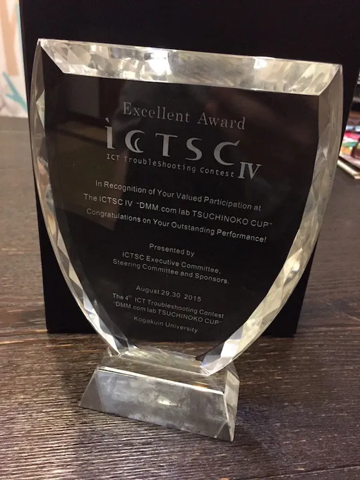

2015年8月29，30日に東京の工学院大学にて開催された，[DMM.com Labo ツチノコ杯 第４回 ICTトラブルシューティングコンテスト](http://icttoracon.net/archives/category/%E7%AC%AC4%E5%9B%9E%E3%83%88%E3%83%A9%E3%82%B3%E3%83%B3)にチーム「コバゼミ」の一員として参加してきた．

前回大会である2015年3月13日から15日にかけて行われた[第3回 ICTトラブルシューティングコンテスト](http://icttoracon.net/archives/category/%E7%AC%AC3%E5%9B%9E%E3%83%88%E3%83%A9%E3%82%B3%E3%83%B3)ではチームメンバーのおかげで最優秀賞をいただけたのだが，僕自身はあまり役には立てず，トラブルを華麗にシュートする快感をあまり得られなかった．

そのため今回のコンテストでは自分の得意な分野であるサーバ系の問題をバリバリ解いてやろうという強い意気込みで参加した．

## コンテストに関して

コンテストでは事前に提示されていた出題範囲において何らかのトラブルやシステム構築の依頼，あるいは外部からの攻撃が行われ，これに対応するスキルが問われるものとなっている．

問題は同時に複数出題されるので，メンバー間で分担して設定された時間までに適切に解決し，原因や具体的な対処手順，結果などをまとめたトラブルチケットを提出することでシュートするといった流れになる．

今回のコンテストにおいて事前に提示された出題範囲は以下のようになっていた．

- Linuxセキュリティ問題
- アプリケーションセキュリティ問題
- サーバパフォーマンス問題
- Cisco ルータ・スイッチ構成問題
- ルーティング・スイッチングプロトコル問題
- HTTPプロキシ・NAT問題
- トンネリング問題
- その他プログラム・サーバ・ネットワークに関連する問題

今回のコンテストでは，合計15チームが参加していた．

## 感想と結果

出題された問題は概ねネットワーク系とサーバ系に分かれていたので，ネットワーク系の問題はこの分野に強い先輩に任せてサーバ系の問題をチームメイトと解いていった．

問題の内容としては時々Webページにつながらないから何とかして欲しいといったものや，Redmineが意図しない動作をするから調査して欲しいといったようなものがあった．

このように依頼が具体性を欠いていてワケが分からないので，問題の説明を軽く読んだらすぐにWebページにアクセスしてトラブルを確認したり，関係するサーバにSSHでログインしてコマンドを叩きまくってログや設定ファイルなどを精査するなどして詳細を把握していった．

先ほど挙げた問題について，まず時々Webページにつながらないという問題については，実際にWebサーバにSSHでアクセスしてみると一定間隔でWebサーバが再起動されていた．ここからサーバのcronやサービスなどを確認したが問題はなく，Webサーバのアクセスログを確認したところShellShockの脆弱性を突いているようなアクセスがあったためbashのバージョンを確認したところバッチリShellShockの脆弱性を有するバージョンだったためアップデートして解決した．

また，Redmineに関しては，RedmineおよびMySQLに設定された文字コードがutf8であるにもかかわらず新規チケットを作成する際に絵文字を入力していたために，特にMySQL側においてエンコードエラーが発生して登録処理が出来ず，Redmineでエラーページが表示されてしまうというものだった．なのでそれぞれの文字コードをutf8mb4に設定して解決した．

他にもプロキシサーバを経由してのWebアクセスが遅いからなんとかしてくれといった問題については，プロキシサーバにおいてtcpdumpでパケットキャプチャするとntpパケットが異様に多い，というかntpパケットしか見えない状況だったため送信元になっていたntpサーバを確認したところ，monlist機能を用いてDDoS攻撃に利用される脆弱性があったので対応したりと，比較的幅広い知識が必要で，問題の切り分けや対処のセンスが問われる，良質な問題ばかりだった．

コンテストの結果，うちのチームは優秀賞をいただくことができた．最優秀賞を受賞したチームとはポイント面では同点だったようなので，どこで差がついたのか，すごく知りたい．

また，サーバ問題のみに専念する形になり，ネットワーク問題の手助けをすることができなかったことが反省点である．Ciscoルータやスイッチを操作してネットワークを構築するスキルは今のところ全くと言っていいほど持っていないので，Ciscoのベンダー資格を取得することを目標に据えて勉強してみたい（基本情報をもっていない雑魚ですが…）．

## おわりに

解き甲斐のある，素晴らしい問題を用意してくださり，スムーズなコンテスト運営をしてくださった運営の皆様，会場を提供してくださった工学院大学様，またこのコンテストのスポンサーとして支えてくれた多くの企業様，ありがとうございました．

このような素晴らしいコンテストがあるおかげで，自分はもちろん，後輩にとっても普段大学ではできないような良い経験，良い勉強ができ，次のステップに繋げることができます．

次回大会がもしあるなら，就活でいそがしいかもしれませんがぜひまた参加したいと思います．

本当にお疲れ様でした．

