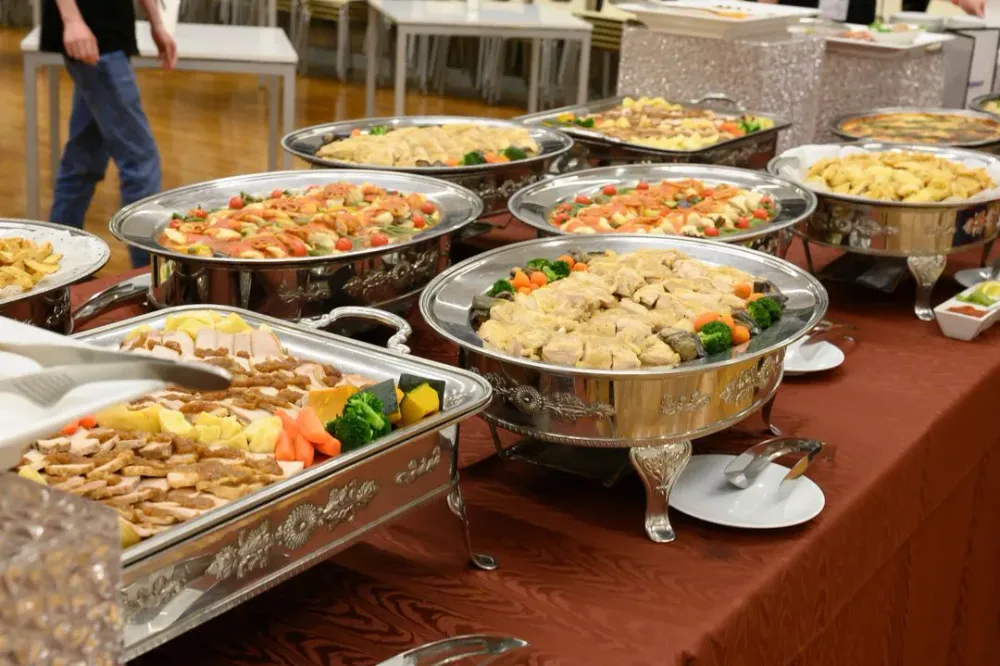
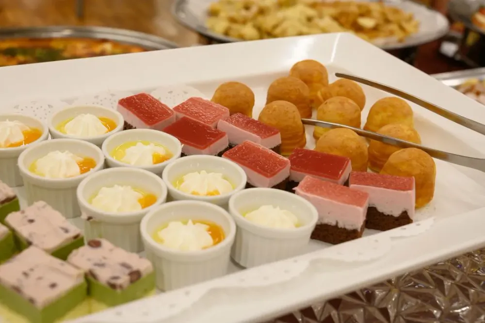

[iOSDC 2019](https://iosdc.jp/2019/) ([`#iosdc`](https://twitter.com/hashtag/iosdc)) の2日目（2019/9/7）参加ログ。

聞いたセッションは以下のとおり。

- テストケースでAmbiguous Layoutを発見する
- モバイル決済アプリの作り方
- 出張版カンファレンス カメラマンカンファレンス
- 今こそwatchOS
- すべての人のためのアクセシビリティ対応
- LT
- NOC LT

あと、懇親会にも参加した。

## テストケースでAmbiguous Layoutを発見する

[テストケースでAmbiguous Layoutを発見する](https://www.icloud.com/keynote/0nUzX497oPS1WvIIOwV1MODLg#iOSDC2019)

[tarunon](https://twitter.com/tarunon)さんによる発表。

iOSアプリのUIを作る際にAutoLayoutを用いた場合、Constraintsでマズイ指定をするとAmbiguous Layoutが発生する。Ambiguous Layoutエラーが発生すると表示が0.3~0.5秒は遅くなることからなるべく対処したいけど、デバッグによってこれの対応をするのは面倒なため、テストによってこれを発見するためのライブラリを開発されたとのこと。その際の知見を発表されていた。

Ambiguous Layoutが発生してしまうConstraintsが何なのかを調べるために`UIViewAlertForUnsatisfiableConstraints(constraint:allConstraints:)`をフックし`allConstraints:`の中身を見たいが、Objective-CではなくCで動いているためにMethod SwizzlingができずまたUIKitCore内部でこのメソッドが呼ばれていることから`facebook/fishhook`を用いることができない。これらの理由から低レイヤに潜ってSwiftでメモリスタックを弄って強引に関数呼び出しを差し替えるデモをされていた。発表内容は高度で理解が追いつかない部分もちょっとあったが、デモ中にコードが思ったように動かない（[Swiftバージョンの差異が原因](https://twitter.com/tarunon/status/1170184317198192649?s=20)）中でライブデバッギングされている貴重な様子を見ることができたしこれはこれで良かったと思う。あとそんな状況でもしっかり発表を継続されているのがホント凄すぎる。

開発されたライブラリを公開されているので、時間を作ってコードを見てみようと思う。

## モバイル決済アプリの作り方

[モバイル決済アプリの作り方](https://speakerdeck.com/kenmaz/how-to-develop-a-mobile-payment-app)

[kenmaz](https://twitter.com/kenmaz)さんによる発表。

モバイル決済アプリを開発されている現場から、開発に際して気をつけるべきこと、開発するための技術要素、また既存アプリにモバイル決済を組み込む際のTipsについて共有いただいた。

日本はキャッシュレス社会を目指して徐々に歩み始めていて、モバイル決済の参入もしやすくなっている。ただお金を扱うことから資金決済法、犯罪収益移転防止法といった法律をしっかり守らないといけない、本人確認でeKYC（スマホのカメラで自分の顔と免許証等の本人確認書類を写すやつ？）も利用できるけどその際もアプリ側で改ざん・偽造がされておらず本人であることをしっかり確保しないといけないという説明があった。この辺り、社内や外部に法律の専門家を抱えていないとサービス始めるのがそもそも厳しいんじゃないかと思った。まぁ人のお金を扱う以上当たり前のことではあるけれど。

また、Apple Payがなぜセキュアなのかについての解説についても図解でわかりやすかった。**Apple Pay Cash日本で使いたい**。

QRコード決済には利用者側がQRコードを提示するCPMと店舗が提示するMPMの二種類があること、それぞれでスクショを取らせないように対策するとか、確かに決済されていることが分かりやすくなるようアニメーション等を工夫するといった具体的な留意点についても共有いただけたのがありがたかった。QRコードの表示とかでOS標準のAPIが用意されているのはiOSが羨ましい。AndroidはZXingとか3rd partyのライブラリを使うのが一般的かなと思うので。

モバイル決済が広まってキャッシュレスが一般的になれば良いなと思うけど、わざわざ新しい仕組みを作らなくてもクレジットカードのNFC payを普及させたら良いじゃんと思っちゃう…。

## 出張版カンファレンス カメラマンカンファレンス

みなさんカメラ・レンズにまぁまぁの額を注ぎ込んでるんだろうなーという感じ。カンファレンス撮影はセッション会場が暗くて被写体が遠くて過酷な現場なんだなーと。

Nikon Z6使ってて24-70/f4の標準ズームを使っているけど、同じズームでf2.8のレンズがなんだか欲しくなってきた。沼…。

## 今こそwatchOS

[今こそwatchOS](https://speakerdeck.com/shu223/jin-kosowatchos-number-iosdc)

[堤 修一](https://twitter.com/shu223)さんによる発表。

初代Apple Watchが発売された当初はハードウェア自体のスペックが低くまたwatchOSが提供するフレームワークも数が揃っていなくて、やりたいことができないような状態がしばらく続いた。そんな状況だったのでWatch用アプリを作る人が離れていってしまったけど、最近になってApple Watchのハードウェアスペックが飛躍的に高くなり、またwatchOSが提供するフレームワークもかなり数が出てきた（音声周りやゲーム、通信、MLとかも）。というか、以前はデジタルクラウンのイベントも取れなかったのか…と驚いた。

またバックグラウンドの状態でもセンサから値を取得できる道ができたので、Watchで出来ることの幅が広がったのはかなり良いことだと思う。

Apple Watchを対象としたアプリが少ない現状はチャンスだと思う。アイデアが欲しい…。

## すべての人のためのアクセシビリティ対応

[すべての人のためのアクセシビリティ対応](https://speakerdeck.com/akatsuki174/subetefalseren-falsetamefalseakusesibiriteidui-ying-ecabd270-51b4-404b-8ebe-de677e09f62a)

[akatsuki174](https://twitter.com/akatsuki174)さんによる発表。

アクセシビリティ対応は、障碍を持つ方のためだけではなく、ネットワークが遅いとか、日差しが眩しくてよく見えないという状況も対象となる。全ユーザが等しく情報を得られるか、アクセスに焦点を置くもの。ユーザビリティは、アクセスできたユーザに対して使いやすいかに焦点を置くもの。

アクセシビリティ対応したところで使ってくれないかも…と考えるのは、開発者自身がアクセシビリティ対応によって得られる恩恵を理解できていないことに起因する妄想かもしれない。その恩恵を理解し、伝えることで使ってくれるかもしれない。

> 多言語対応はするのにアクセシビリティ対応はしないんですか？

アプリデザインにおけるタップ領域の確保（44 * 44 px以上）や要素を密集させないみたいなものは、デザイナさんから頂く指示でも稀ではあるけど時々考慮されていない場合があるので、エンジニアである僕からも指摘できるよう気をつけたい。Androidアプリを作っていた時に、デザインを崩したくないからみたいな理由でよく文字サイズをspではなくdpで指定するみたいなことをしていたけど、あれは端末の文字サイズ設定を無視してしまうからやっちゃダメなんだよな。こういう部分も指摘していこうと思った。

アプリを作る際にDynamic TypeやLarge Textも考慮していきたいし、Accessibility Inspectorで自分が関わったアプリの検査もしてみたいな。

あとはVoiceOver対応、UI作る際にaccessibilityLabelとかaccessibilityTraits、accessibilityHintには目を向けていなかったけど、次iOSアプリを作る際はこの部分にも注意を払ってコードを書いていこうと思う。

うちの会社はユーザ目線でユーザを幸せにするプロダクトを作ることを社是にしているんだから、このような部分にこそ注意を払わないとな。

### 懇親会

懇親会という場は本当にどうしようもなく苦手だけど、それでもなんとか何人かの他社さんの方々とお話しすることができた。慣れるには回数をこなすんが良いんですかね…。

## まとめ

会社の先輩方から背中を押してもらって今回参加したけど、iOSDC 2019 参加して本当に良かった。全てのセッションで発表する側と聞いてる側の一体感みたいなものがあって、すごく暖かい雰囲気だったように感じた。

このカンファレンスで得た知識・経験を業務とプライベートの双方で活かしていきたいと思う。2020があるなら、参加したいな。

