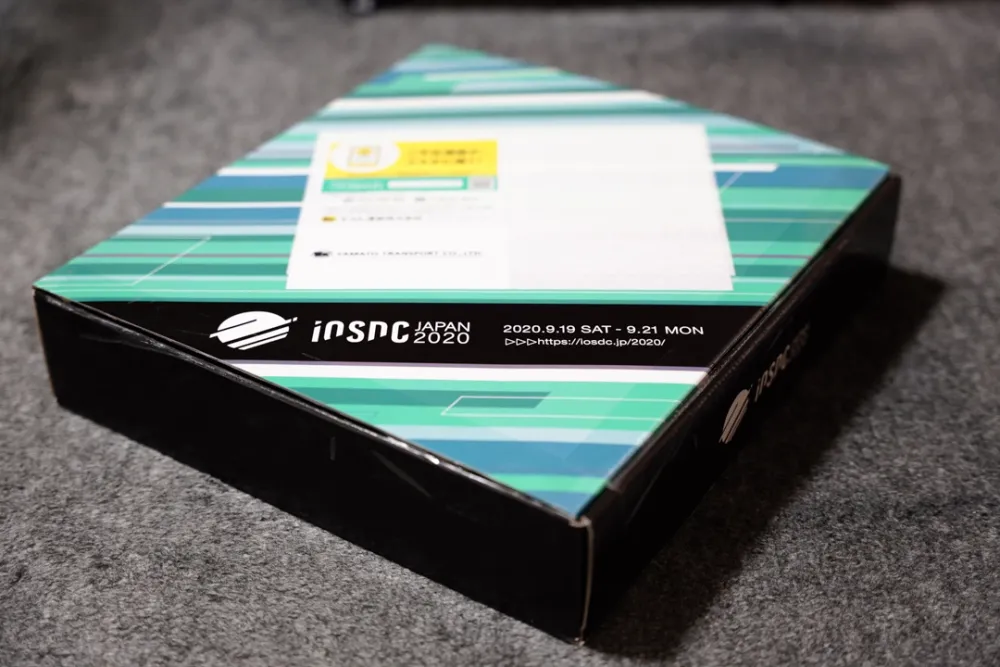
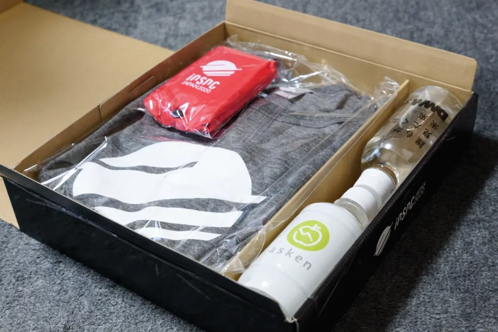
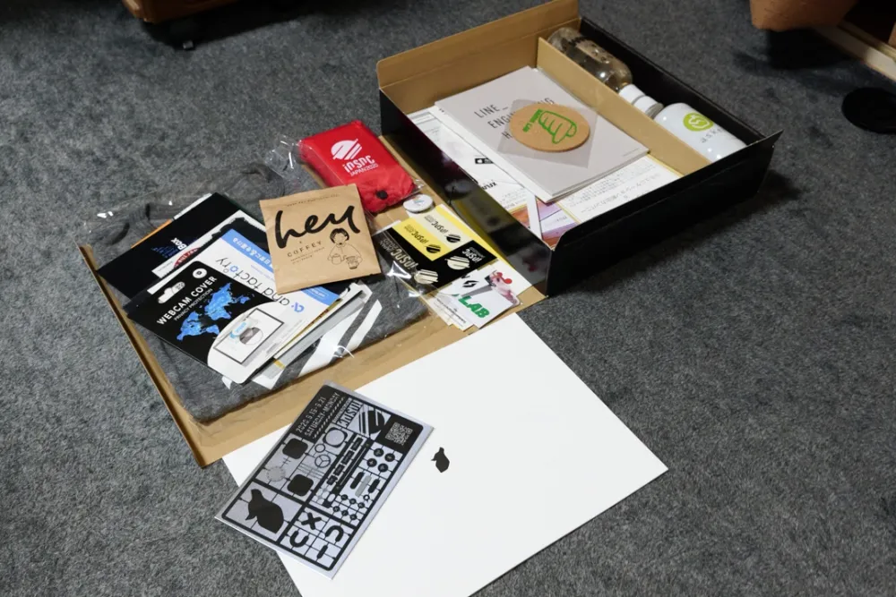

9/19（土）〜9/21（月）、[iOSDC Japan 2020](https://iosdc.jp/2020/)に参加した。

今年はコロナ禍ということもあり、初のオンラインでの開催だった。

トークの配信形式はニコ生、リアクションはニコ生のコメントか、Twitterで。Ask the speakerや発声可能パブリックビューイング、雑談はDiscordで、という形だった。

ノベルティについては、ノベルティボックスという形で事前に郵送されており、箱のデザインが素晴らしく、内容物もぎっしり盛り沢山で各社嗜好を凝らしたもので良かった。

ノベルティボックス

ノベルティボックスを開けたとこ。ボトルウォーターが2本もある。

ちょこっと中身を取り出したところ

19日は前夜祭、20日と21日が本番という例年の形だけど、前夜祭からめちゃくちゃ濃いトークを聞けるので、すべての日程で参加した。

それぞれの日程で聞いたトークと、それらの簡単なメモを書いておく（LTは除く）。

## Day 0（前夜祭）

### [SourceKit LSPをブラウザでコードを読むために活用する](https://fortee.jp/iosdc-japan-2020/proposal/5915f415-c824-437f-9cac-312e8454ea91)

LSP: Language Server Protocol、任意のテキストエディタで、オートコンプリートやシンボルの定義元へのジャンプなどのコーディングにおいて欠かせないこれら機能の実現に必要となる情報を、与えられたソースコードを解析し返却するサービスであり、言語間やIDE間の差異を抽象化する仕様のこと。Swift言語においてはXcodeに付属する`SourceKit-LSP`がこれにあたり、これに対応させると、Xcode以外の、例えばVisual Studio Codeなどの任意のエディタでも、Swift言語を用いたコーディング時においてオートコンプリート等の機能が活用できる。

このトークでは、ブラウザ拡張として`SourceKit-LSP`を用いるプラグインを実装する過程で得た知見を共有されていた。

普段Android StudioでAndroidアプリを書き、JetBrains系IDEの快適さに浸っている身としては、Xcodeはかゆいところに手が届かない（Typo検出とかコードフォーマッタとか？）という感触があった。AppCodeを利用すればいいという話ではあるが、やろうと思えばほかの任意のエディタやブラウザでもオートコンプリート等が行える環境を用意できるのだ、という知見を得られ、前夜祭一発目からかなりテンションが上がった。

### [HomeKit 2020](https://fortee.jp/iosdc-japan-2020/proposal/5c2600f9-b27b-4deb-abd4-85cb7062553e)

ホームアプリでの家電操作においてお世話になっているHomeKit。その構成から実装まで説明されていた。

Bridgeについても説明されていた。僕自身もNature Remo + Homebridgeという構成でお世話になっていたので、なるほどなーと。

HomeKit対応した家電が市場に広く出回って欲しい。

### [J2ObjCを使ってJava資産をiOS開発で使ってみた](https://fortee.jp/iosdc-japan-2020/proposal/a94bc318-9ba2-4c22-8e32-6be8fdcb8716)

既存JavaコードをJ2ObjCでObjective-Cに変換し、マルチプラットフォーム開発においてコードを共有する方法を説明されていた。

J2ObjCで変換したコードで例外が出た場合、Java由来のエラーがiOS端末に出るのが面白い。JavaからObjective-Cに変換する際、メモリ管理を意識し弱参照を大事にするとか、Objectiv-CからSwiftへの変換を見越してNullabilityに配慮するとか。国内での知見がないことも含め、辛そう。

今だとKotlin Multiplatformを採用するかな。

## Day 1

### [Apple Pencil対応の勘所を話します](https://fortee.jp/iosdc-japan-2020/proposal/348c2d74-7855-4d8b-8457-db9df25f9a7c)

僕自身がお仕事でPencilKit触ることは今までなかったし、これから触ることもないかもだけど、周りを見ると触っている人が全くいないという訳ではないし、iPad ProとApple Pencilをせっかく持っているので聞いてみた。iPadOS 14でScribble出たし。

内容かなり充実して、聞いて良かった。上長からApple Pencil対応知ってる？って無茶ぶりが来てもなんとかなりそう。拡張性がほとんどないフレームワークで、ToolPickerなんかはデザイン変更できないとのこと。ブランディングを考えると辛いのかもだけど、Appleさん側で「こう実装してね」ってはっきり決められているのは、OS内での世界観が保たれるのでわりと好き。

### [キーワード多すぎ！なエンタープライズiOSの世界を概観する - 2020年版](https://fortee.jp/iosdc-japan-2020/proposal/4fb18e61-362c-4767-bf5b-2f1fcb759ee1)

会社に知見を持ち帰るために聞いた。ちょうどADEPから移行したいよねーって話が上がってたので。

App Storeインフラに統合したいって思惑がAppleにあるのかなという話。`Apple Business Manager`の契約をして、組織IDをもらわなきゃいけない。プライベートにアプリを配布する場合は、ADEP -> `CustomApp`に移行する。AppStoreインフラを使った企業向けストアという位置づけとのこと。

App Store Connectでアプリ配信先を選択する際に、Business ManagerまたはSchool Managerのやつを選択するとCustomAppに配信できるらしい。Apple Business Managerで見えるから、MDMでの配布ができる。CustomAppだとTestFlightが使えるってのもよさげ。非公開アプリでも審査が入るってのはちょっとめんどいかも。

なんにせよ、CustomApp使うためにはApple Business Managerを契約して得られる組織IDが必須となる。

Device Enrollment Programってのも初めて聞いた。MDMに端末チェックインさせるために有線接続しないといけないけど、対象台数が膨大とか、遠隔地だとかだと大変だよなーって思ってた。このプログラムで端末調達すると、端末出荷前段階でシリアル番号確認できて、端末起動で自動的にMDMチェックインされて監視モードが有効になるとか。最高かよ。

一から十までめっちゃ中身の詰まった、すごく有益なトークだった。必要があれば、このトークを参考に会社用にドキュメントまとめたい。

### [機械学習のブルーオーシャン、Core ML](https://fortee.jp/iosdc-japan-2020/proposal/2d8f5458-140e-4c68-95f1-30964d605013)

Core ML用の学習済みモデルを動かすだけ、ではなく、PyTorchとかTensorFlow Liteなどを対象としたCPUあるいはGPUでしか動かせない学習済みモデルを、最近のiOSデバイスのチップセットにあるNeural Engineを活用して高速に動かすために、Core ML用にモデルを変換する方法や、変換ツールが対応していない循環グラフを取り除くためのコツについて説明されていた。

Appleが提供するフレームワークを活用すれば、デバイスが持つ演算能力をフル活用できるし良いよね。

[ご本人がYoutubeでトーク公開されている](https://www.youtube.com/watch?v=IF30hznYyJ4)ので、改めて内容を見返す。

### [エラーアーキテクチャ設計について考える](https://fortee.jp/iosdc-japan-2020/proposal/68905652-4f5d-444b-965f-ba572b750467)

ほかの誰かが書いたコードで、エラーの取り回しに苦労したことがあった気がする。「雨の日」のシナリオを見つめ、読み手側がこのシナリオを理解しやすくし、考慮漏れ・実装漏れを仕組みによってコンパイル時等で気づけるような、良いエラーアーキテクチャを常に意識したいなと思った。

### [iPadOSDC: Multiple Windows](https://fortee.jp/iosdc-japan-2020/proposal/b60ddbb9-7b37-4f24-b530-c87581d35e43)

iPadOSのMultiple Windows対応の流れについてコードベースで説明された。iOS 13以降のみをサポートする場合は、このトーク見れば対応できそう。iOS 12以前のサポートはもう不要だよね。iOS 14もう出てるし。

### [効率よくUIKitからSwiftUIへ移行する](https://fortee.jp/iosdc-japan-2020/proposal/80ac8a83-e34a-48cf-b1ca-cb553857715f)

SwiftUIに移行すべきかどうか、Pros, Cons双方の見解を述べて冷静に判断されているのがすごい。

移行前にどのような準備をしておくのが良いか。小さいUIコンポーネントに分けて部分的にSwiftUI導入できるようにするとか、コードでViewを書くとか、FRPに馴染んどくとか。

SwiftUIで書きづらい場合、HIG準拠できてないのかもってのは良かった。

簡単な部分からはじめる。急ぎすぎない。何事においても大事だよね。

## Day 2

### [Xcode PreviewでUIKitベースのアプリ開発を効率化する](https://fortee.jp/iosdc-japan-2020/proposal/a88be712-b87a-4d87-bc6d-2579c2ce9b35)

UIKitなコードでもXcode Previewが使えるんやねってのと、複数の表示パターン（例えば文字数が多い場合、とか）をあらかじめ実装しておけば、Preview画面内でスクロールすることでそれらパターンを反映したViewがずらっと並んで表示を見られるのが最高かよってなった。

Viewに外部からデータをインプットし表示に反映できるような、Previewableな実装にしないといけない、という点はあるものの、Previewさせるために必要となるコードの実装はそこまで大変そうではなさそうだし、先々UIKitベースで画面作らないといけない、みたいなのに遭遇したら対応させたい。さすがに次iOSアプリ開発のお仕事に回されるような時は、SwiftUIベースの開発になってるかな？

### [iOSアプリ開発のための"The Composable Architecture"がすごく良いので紹介したい](https://fortee.jp/iosdc-japan-2020/proposal/40b59a33-1f0a-45ba-ba94-10ce9cf960f4)

The Composable Architecture、知らなかった。データフローめっちゃ綺麗で、これ採用された実案件コード見たらたぶん感動すると思う。他アーキテクチャとの混合が難しいから、やるならThe Composable Architecture一本で開発進めないといけないってのがちょっとネックかな。勇気がいりそう。

リファレンスも充実してるみたい。ちょっと調べてみようかな。

### [Webとネイティブアプリの付き合い方を改めて考える](https://fortee.jp/iosdc-japan-2020/proposal/d996c43a-834b-4bfe-b15a-67457725da02)

PWAとかも出てきて、Webアプリで対応するという選択肢も出てきた今、ネイティブで作るのかWebで作るのか、どう考えれば良いかという点について比較表を作りながら説明されていた。

Webで出来ることも増えてきてる。アニメーション（例えば画面遷移時）とかプッシュ通知（Android側だと、Webアプリでもプッシュ通知が効く。iOSは無理）とか、ネイティブアプリでしか提供できない体験を重視するかを考える。

Android側は、PlayストアでPWAを公開できるとか、プッシュ通知が効くとかで、ネイティブではなくWebアプリで作るってのがiOSと比較してよりカジュアルにできそう。iOSネイティブ & Androidネイティブ、の代わりに、iOSネイティブ & Android PWAって選択肢も出てきそう、って話されてたし、Androidアプリ開発者としてはちょっと辛い。

### [SwiftUIを導入したアプリ設計](https://fortee.jp/iosdc-japan-2020/proposal/ba38e62e-f96c-4989-86d5-29f441e7a80b)

SwiftUI導入を検討する際に検討した事項、なぜUIKitベースで現状は実装するのが良いかについて説明されていた。

画面の出し分け、画面遷移時のFirebase Analytics自動トラッキングが効かないとかが辛そう。自前トラッキングはちょっとダルいな。

SwiftUIに適した設計になっていないようであれば、UIKitベースで実装するのがよさそう。

### [SwiftUI時代のFunctional iOS Architecture](https://fortee.jp/iosdc-japan-2020/proposal/6d88c4dc-5a24-4c07-b505-65e2c389cdfb)

アーキテクチャのベースになっている思想を知ると、理解がさらに深化できるのだろうな。圏論勉強しなきゃ。

https://qiita.com/inamiy/items/922d4220bf407efa2dab

### [Apple Siliconへの長い道](https://fortee.jp/iosdc-japan-2020/proposal/0188c283-2804-42cc-acb2-0287ec38ca57)

やっぱりhakさん、めちゃくちゃ話がうまいなーと思った。ディスプレイ解像度の拡大と、SoC GPUの処理能力のバランス、これが崩れたデバイスはパフォーマンスが悪いと世間的にいわれてたりとか、デバイスをチップセットから見るの大事だなと思った。Apple Siliconが載ったPCが出るの、楽しみ。

## 感想

めちゃくちゃ濃ゆい3日間、本当にあっという間だった。

関西に住んでいる身としては、東京まで行くのは本当に一仕事なので、オンラインで参加できるというのはかなり楽だった。環境の整った自室で参加できるので、トークにも集中できる。

今回はトークに対するリアルタイムのレスポンスとして、主にニコ生のコメントと、Twitterのツイートの二通りがあったのかなと思うけど、どっちに書いたら良いかなって迷うことが多かったかなと思う。

どのトークにも興味が沸き、時間がかぶりまくっていた。後日配信されるとのことなので、時間作ってじっくり見ていきたい。パンフレットの方も見なきゃ。

