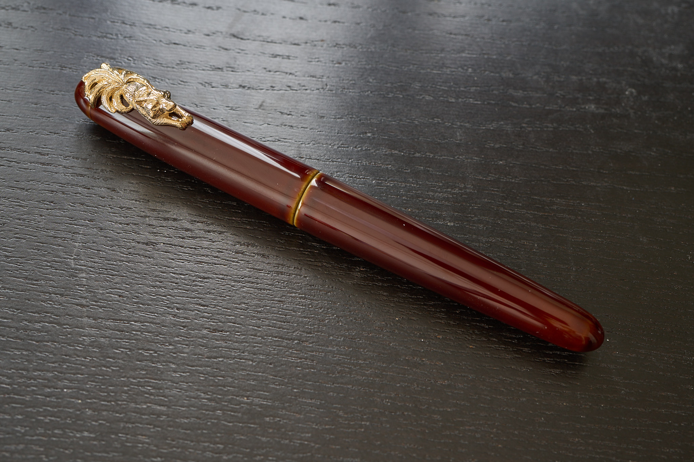
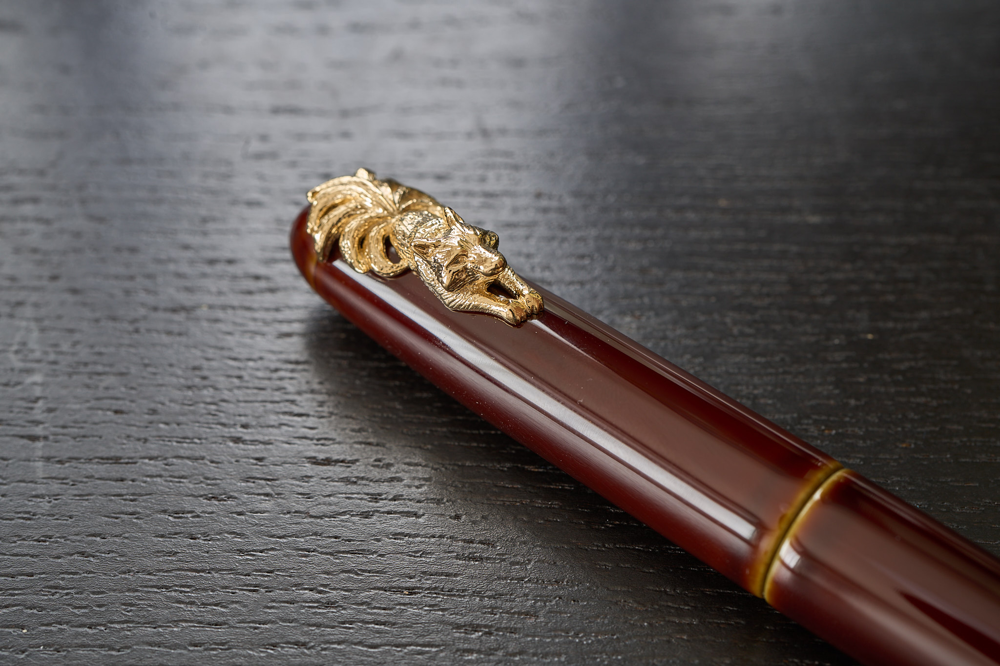
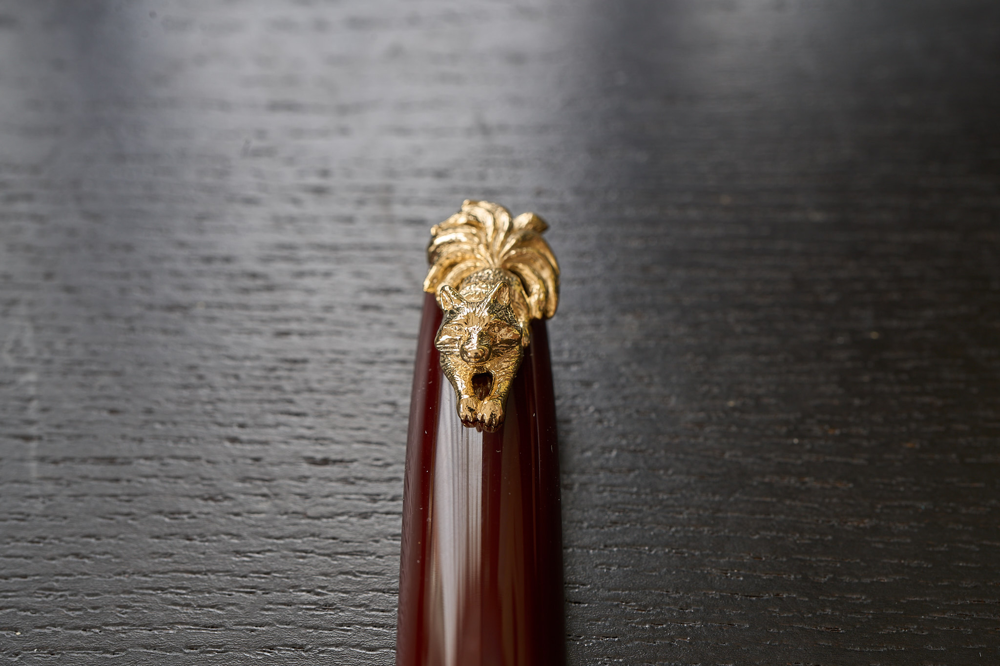
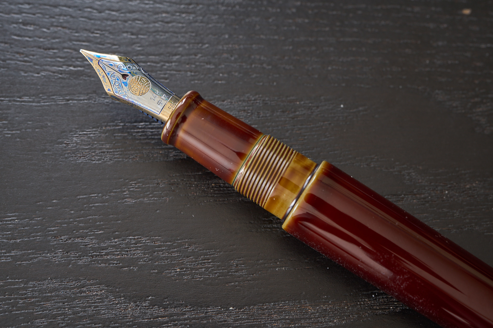
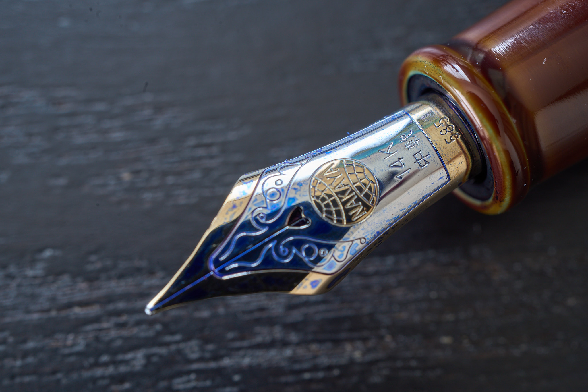
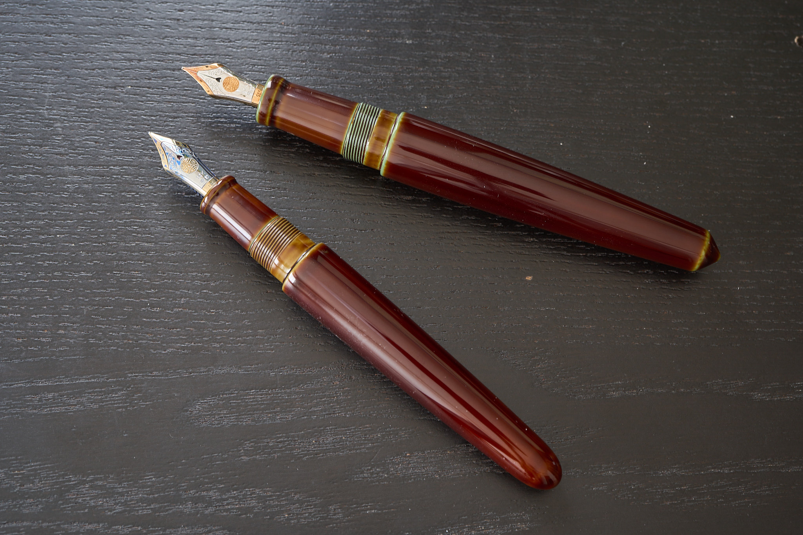
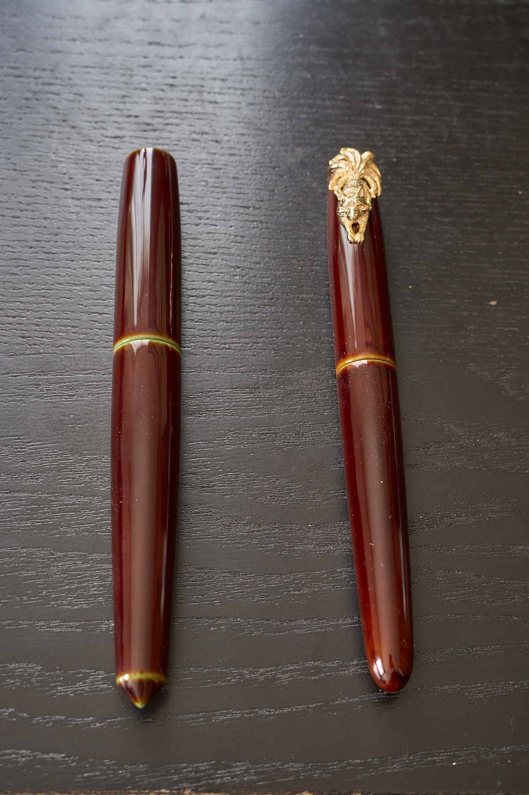

去年の夏頃に思い切ってオーダーした中屋万年筆さんのペンが、ついに手元に届いた。選んだのは、[ライターポータブルの碧溜](https://nakaya.org/review.aspx?id=187&type=body)で、字幅は中軟字、クリップの代わりに[九尾の狐の廻り止め](https://nakaya.org/review.aspx?id=44&type=clip)をつけてもらった。注文はWebから。

段ボールから桐箱を取り出し、万年筆入れからペンを取り出し、溜め息が出た。

飴っぽい色合いの表地と、下地の碧色がすごく良い。

あと、廻り止めとして付けてもらった九尾の狐がカッコかわいい。ぎゅっと踏ん張っているところとか、尻尾のふさふさ感とか。

九尾の狐をどの色合いにするかでかなり悩んだけど、金狐というし軸が碧溜で飴っぽい色合いなので、イエローゴールドメッキにしてもらった。結果、軸色とピッタリ馴染む色合いでよかった。

ネジが切られている部分で、下地が透けていて綺麗。

ペン先を素のゴールドのままにするか、染め分けにするかでも悩んだけど、染め分けにしてもらった。メリハリが効いて好みかな。今のところ、軟らか目のペン先が好みなので、中軟字。インクはプラチナ万年筆さんのブルーブラック。

中屋万年筆さんのペンに関しては、既に両切りの碧溜を既に持っていた。角が立っている方が両切りで、丸い方が今回購入したライターポータブル。

長さは同じくらいで、両切りの方が若干太い。両切りの方はクリップ・廻り止めを付けられないので、ペンをデスクマットなどを敷いていない机の上に置くと、コロコロと転がってしまう。ペン置きを持っているが、「そこに置かないといけない」のが面倒だったので、今回廻り止めをつけられるライターポータブルを買った。

注文時に入力したカルテを参考にペン先を調整してくれる中屋万年筆さんなので、インクフローは快調で何の問題もない。そもそもその点は心配してなかったけど。

長く使っていきたい。
