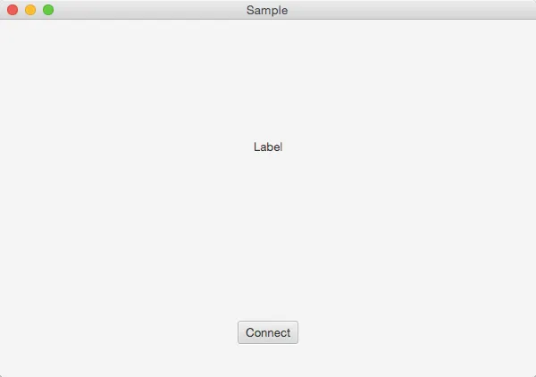

SocketサーバをPython，クライアントをJavaFXで構築し，サーバから送信されてきた文字列データをクライアントのUIに反映させる方法に詰まったのでメモ．

*（追記）Controller.javaにおいて，Threadクラスを用いて非同期処理を行うのは良くないとのご指摘を頂きましたので，ExecutorServiceを用いて再実装しました．*
*もしまだ修正すべき点などございましたら，ご指摘のほど宜しくお願いします！*

## サーバサイド（Python）

まずはPythonで書いたサーバサイドのコードを載せる．

```python
#!/usr/bin/env python
# -*- coding: utf-8 -*-
	
import socket
	
	
def main():
    host_ip = '127.0.0.1'
    host_port = 51001
    buffer_size = 1024

    sock = socket.socket(socket.AF_INET, socket.SOCK_STREAM)
    sock.bind((host_ip, host_port))
    sock.listen(1)

    while True:
        print 'Waiting for connection...'
        conn, addr = sock.accept()
        print '...connected from: ', addr

        # 送信データには，必ず\r\nを付与すること
        # クライアントからの情報受信も行い，'close'あるいは何もないデータを受信したら接続を終了する
        while True:
            # 送信するデータを入力させる
            send_data = raw_input('> ')

            # 入力されたデータをクライアントに送信
            conn.send(send_data + "\r\n")

            # クライアントは，情報を受信したら必ずサーバに'receive'あるいは'close'，空文字を送ること
            received_data = conn.recv(buffer_size)

            if not received_data or received_data == "close":
                # データ受信が終了（clientが接続を閉じた）
                break

        conn.close()
    sock.close() # Never executed
	
	
if __name__ == '__main__':
    main()
```

動作の流れは以下の感じ．

- 待ち受けるIPアドレス及びポート番号を指定し，クライアントからの接続を待ち受ける．
- 接続されたらユーザからのデータ入力を待ち受け，入力されたデータをクライアントに送信する．
- クライアントからのデータ送信を待ち受ける．
- 空のデータか，"close"という文字列が送られてこない限り，再びユーザからのデータ入力を待ち受ける．

ちなみにこのプログラムはサーバプログラムであり，動かし続けてクライアントからの接続を待ち受け続ける必要があるため，ソケットを閉じる`sock.close()`は実行されないようになっている．

## クライアントサイド（JavaFX）

次に，JavaFXで書いたクライアントサイドのGUIアプリケーションコードを載せる．

```java
package sample;

import javafx.application.Application;
import javafx.fxml.FXMLLoader;
import javafx.scene.Scene;
import javafx.stage.Stage;

import java.io.IOException;

public class Main extends Application {
    @Override
    public void start (Stage primaryStage) throws IOException {
        // fxmlをロードする
        FXMLLoader fxmlLoader = new FXMLLoader(getClass().getResource("sample.fxml"));
        primaryStage.setTitle("Sample");
        primaryStage.setScene(new Scene(fxmlLoader.load(), 600, 400));

        Controller controller = fxmlLoader.getController();

        primaryStage.setOnCloseRequest(e -> {
            controller.stageClose();
            primaryStage.close();
        });
        primaryStage.show();
    }

    public static void main (String[] args) {
        launch(args);
    }
}
```

このソースコード（`Main.java`）は，プログラムの起点となる．あらかじめ作成しておいた`sample.fxml`をもとにインタフェースの校正を行い，`primaryStage.show()`でウインドウを表示する．

次に，GUIのレイアウトファイルとなる，`sample.fxml`を載せる．

```xml
<?xml version="1.0" encoding="UTF-8"?>

<?import javafx.scene.control.*?>
<?import javafx.scene.layout.*?>

<VBox fx:controller="sample.Controller" maxHeight="-Infinity" maxWidth="-Infinity" minHeight="-Infinity" minWidth="-Infinity" prefHeight="400.0" prefWidth="600.0" xmlns="http://javafx.com/javafx/8" xmlns:fx="http://javafx.com/fxml/1">
  <children>
    <Pane prefHeight="300.0" prefWidth="600.0">
      <children>
        <Label fx:id="label" alignment="CENTER" contentDisplay="CENTER" layoutX="284.0" layoutY="134.0" text="Label" />
      </children>
    </Panel>
    <Panel prefHeight="100.0" prefWidth="600.0">
      <children>
        <Button fx:id="button" onAction="#buttonClick" layoutX="266.0" layoutY="37.0" mnemonicParsing="false" text="Connect" />
      </children>
    </Panel>
  </children>
</VBox>
```

上記fxmlファイルより構成されたウインドウ画像を下に載せる．



さて，それではこのクライアントプログラムのイベント処理を行うコントローラクラスのソースコード（`Controller.java`）を載せる．

```java
package sample;

import javafx.concurrent.Task;
import javafx.fxml.FXML;
import javafx.scene.control.Button;
import javafx.scene.control.Label;

import java.io.BufferedReader;
import java.io.BufferedWriter;
import java.io.InputStreamReader;
import java.io.OutputStreamWriter;
import java.net.Socket;
import java.util.concurrent.ExecutorService;
import java.util.concurrent.Executors;

public class Controller {
    // fxmlのfx:idによる指定で結びついている
    public Label label;
    public Button button;

    // socket接続を切断する際は，これをfalseにする．
    public static volatile boolean connectStatus = false;
    SocketTask socketTask = null;

    // スレッドプール
    private ExecutorService service = Executors.newSingleThreadExecutor();

    @FXML
    public void buttonClick () throws InterruptedException {
        // Connectボタンがクリックされた際に呼び出される
        // fxmlのonActionで結び付けられている
        if (!connectStatus) {
            socketTask = new SocketTask();

            // socketTaskからのupdateMessageとlabelのテキストを同期する
            label.textProperty().bind(socketTask.messageProperty());

            // socketTask終了後の処理
            socketTask.setOnSucceeded(e -> label.textProperty().unbind());
            socketTask.setOnCancelled(e -> label.textProperty().unbind());
            socketTask.setOnFailed(e -> label.textProperty().unbind());

            // socketTaskを実行する
            service.submit(socketTask);
        }
        else {
            connectStatus = false;
            socketTask = null;
        }
    }

    public void stageClose() {
        // stageをcloseする際に，スレッドプールをshutdownする
        service.shutdown();
    }
}


class SocketTask extends Task {

    @Override
    protected Object call () throws Exception {
        String dstIP = "127.0.0.1";
        int dstPORT = 51001;

        Socket socket = new Socket(dstIP, dstPORT);
        Controller.connectStatus = true;

        // メッセージ取得オブジェクトのインスタンス化
        BufferedReader bufferedReader = new BufferedReader(new InputStreamReader(socket.getInputStream()));
        BufferedWriter bufferedWriter = new BufferedWriter(new OutputStreamWriter(socket.getOutputStream()));

        while (true) {
            String receivedText = bufferedReader.readLine();
            updateMessage(receivedText);

            if (Controller.connectStatus) {
                bufferedWriter.write("received");
                bufferedWriter.flush();
            }
            else {
                bufferedWriter.write("close");
                bufferedWriter.flush();

                bufferedReader.close();
                bufferedWriter.close();
                socket.close();
                break;
            }
        }
        return null;
    }
}
```

このクラスは，fxmlのロード時にインスタンスが作成される．そして`Connect`ボタンがクリックされることでイベントが発火し，処理が行われていく．
Socket通信を行うためのSocketTaskクラスは，Taskクラスを継承させている．このクラスによるSocket通信を行う前に，あらかじめ`label`の`textProperty`とSocketTaskクラスの`messageProperty`をbindさせておき，その後にExecutorServiceによりSocket通信処理を走らせている．

Taskクラスには，messagePropertyを更新する`updateMessage(java.lang.String message)`というメソッドがあり，これによりサーバより受信したテキストデータを渡すことで動的にlabelを更新することが可能となる．

このTaskというクラスを活用し，今回用いた`updateMessage`や`updateProgress`，`updateTitle`のようなメソッドを用いることで，独自に作ったスレッドから，UIを扱うスレッドに働きかけることが可能となる．

